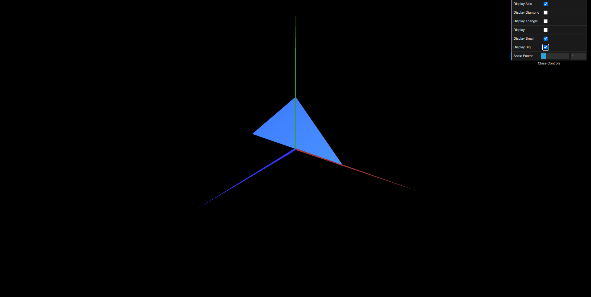

# CG 2023/2024

## Group T08G03

## TP 1 Notes

- In exercise 1 we observed that the order of the indexes is important regarding where the triangle should be facing; we also noticed that making a figure double-sided wasn't as straightforward as we thought
- In exercise 2 we had no major difficulties

