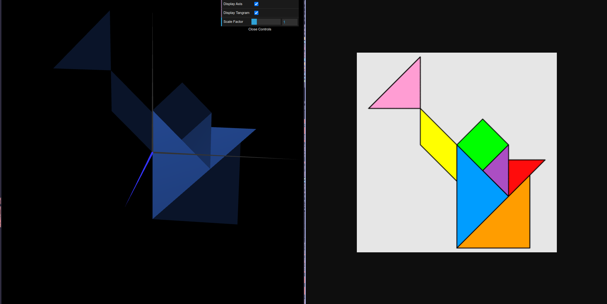
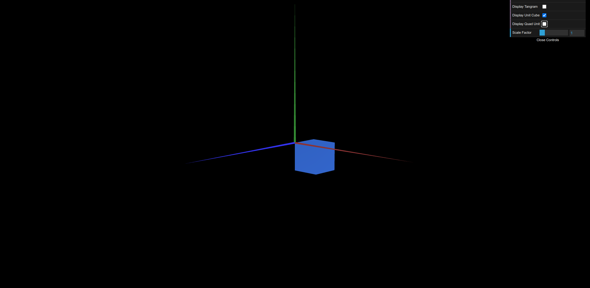
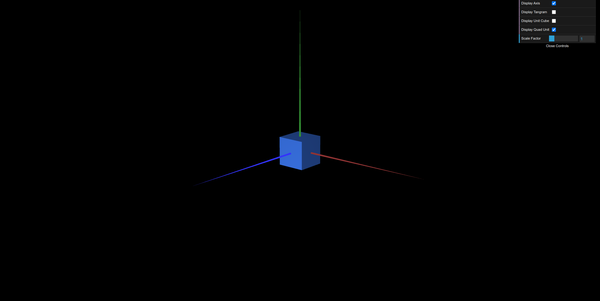

# CG 2023/2024

## Group T08G03

## TP 2 Notes

- In exercise 1, the main difficulty was to understand how to work with the stack.
- We had no major difficulties in exercise 2.
- In exercise 3, the main issue we faced was to properly rotate every square so as to form the cube.

