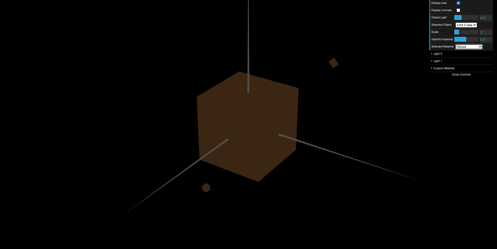
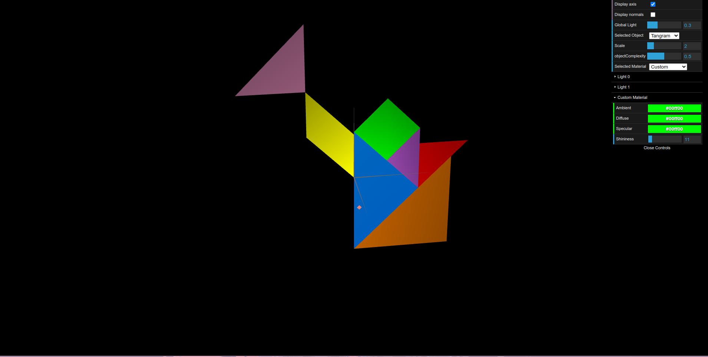
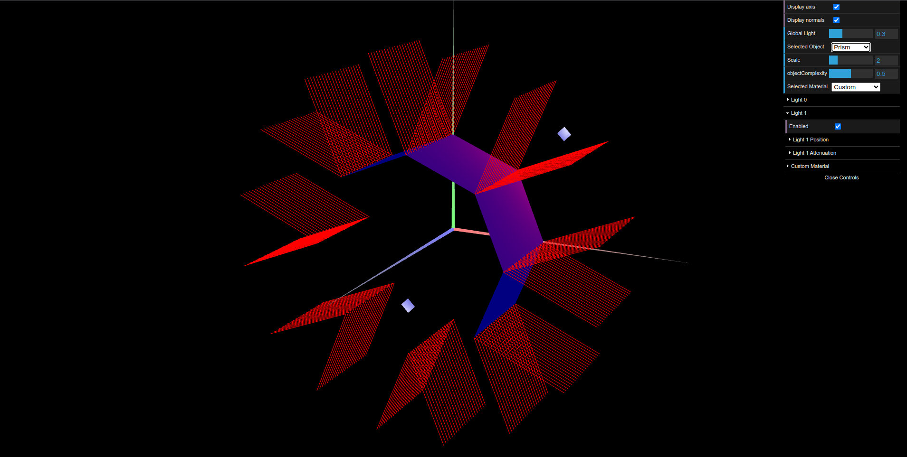
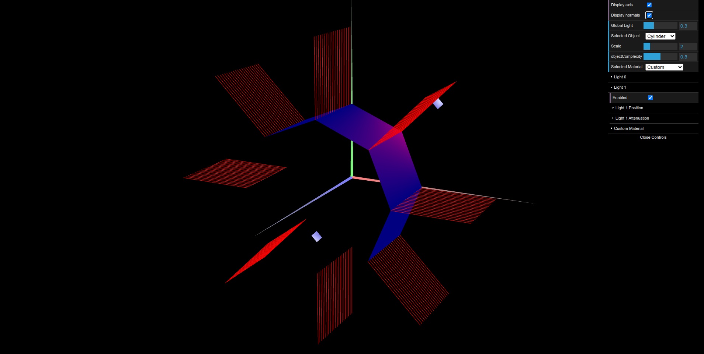

# CG 2023/2024

## Group T08G03

## TP 3 Notes

- We had no major difficulties in part 1.
- In part 2, the main challenge was to draw the prism correctly so that the normals on each slice's vertex would be correctly displayed.
- In exercise 3, the main issue we faced was to properly rotate every square so as to form the cube. In part 3, the main issue we faced was to adapt MyPrism into the MyCylinder object.

